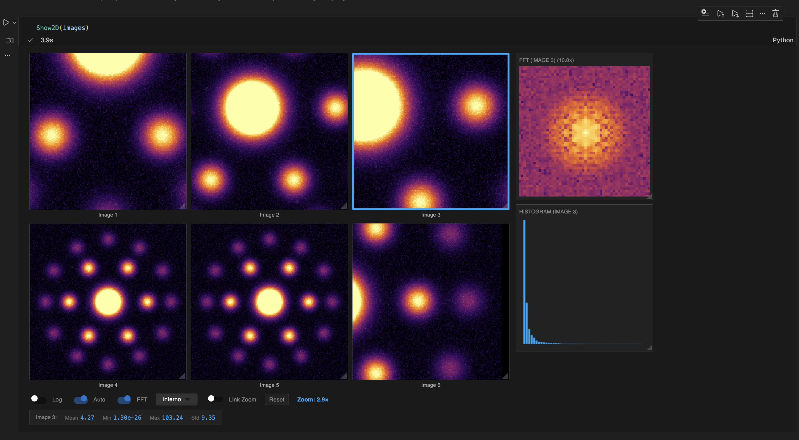
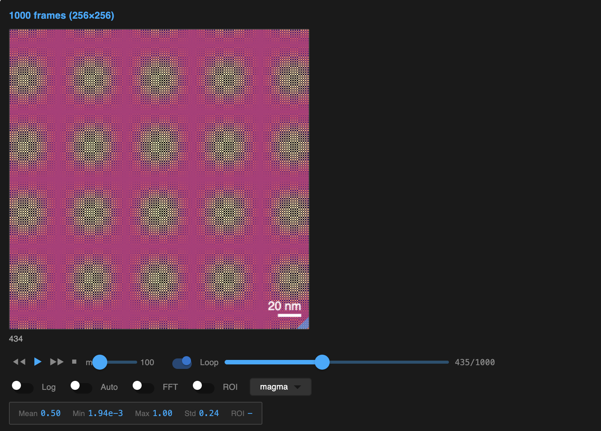

# bobleesj.widget

[](https://github.com/bobleesj/bobleesj.widget/actions/workflows/ci.yml)
[](https://www.python.org/downloads/)

Interactive Jupyter widgets for scientific image visualization. Works with NumPy, CuPy, and PyTorch arrays.





## Installation

```bash
git clone https://github.com/bobleesj/bobleesj.widget.git
cd bobleesj.widget
pip install -e .
```

No npm or Node.js needed – the JavaScript is pre-compiled.

## Quick Start

### Show2D – Static Image Viewer

```python
import numpy as np
from bobleesj.widget import Show2D

# Single image
image = np.random.rand(256, 256)
Show2D(image)

# Multiple images (gallery mode)
images = [img1, img2, img3]
Show2D(images, labels=["A", "B", "C"])
```

### Show3D – Stack Viewer with Playback

```python
import numpy as np
from bobleesj.widget import Show3D

# 3D stack (z-stack, time series, defocus series)
stack = np.random.rand(100, 256, 256)  # 100 frames
Show3D(stack, title="My Stack", fps=5)

# With labels and timestamps
labels = [f"Frame {i}" for i in range(100)]
Show3D(stack, labels=labels, pixel_size=1.5)
```

## Interactive Controls

| Action | Control |
|--------|---------|
| **Zoom** | Scroll wheel |
| **Pan** | Click and drag |
| **Reset** | Double-click |
| **Resize** | Drag corner handle |

## Features

- 🖱️ **Interactive**: Zoom, pan, resize in the browser
- ⚡ **GPU-accelerated**: Real-time FFT via WebGPU
- 🔌 **Universal arrays**: NumPy, CuPy, PyTorch
- 📦 **Anywidget-based**: JupyterLab, VS Code, Colab

## API Reference

### Show2D

```python
Show2D(
    data,                       # 2D array or list of 2D arrays
    title="",                   # Title above the image
    labels=None,                # Labels for gallery mode
    cmap=Colormap.INFERNO,      # inferno, viridis, magma, plasma, gray
    pixel_size_angstrom=0.0,    # Pixel size for scale bar (0 = hidden)
    show_fft=False,             # Show FFT and histogram panels
    show_stats=True,            # Show statistics (mean, min, max, std)
    log_scale=False,            # Logarithmic intensity scaling
    auto_contrast=False,        # Percentile-based contrast
    ncols=3,                    # Columns in gallery mode
)
```

### Show3D

```python
Show3D(
    data,                       # 3D array (frames, height, width)
    title="",                   # Title above the image
    labels=None,                # Label for each frame
    cmap=Colormap.MAGMA,        # inferno, viridis, magma, plasma, gray
    pixel_size=0.0,             # Pixel size in nm (0 = no scale bar)
    fps=1.0,                    # Playback speed (frames per second)
    loop=True,                  # Loop playback
    show_fft=False,             # Show FFT and histogram panels
    show_stats=True,            # Show statistics (mean, min, max, std)
    log_scale=False,            # Logarithmic intensity scaling
    auto_contrast=False,        # Percentile-based contrast
    timestamps=None,            # Timestamps for each frame
    timestamp_unit="s",         # Unit for timestamps
)
```

📓 **Example notebooks:**
- [show2d_single.ipynb](notebooks/show2d_single.ipynb) – Single image tutorial
- [show2d_multiple.ipynb](notebooks/show2d_multiple.ipynb) – Gallery mode tutorial
- [show3d.ipynb](notebooks/show3d.ipynb) – Stack viewer tutorial

## Requirements

- Python 3.11+
- JupyterLab, VS Code with Jupyter, or Google Colab

## Contributing

See [CONTRIBUTING.md](CONTRIBUTING.md) for developer setup.

## License

MIT
